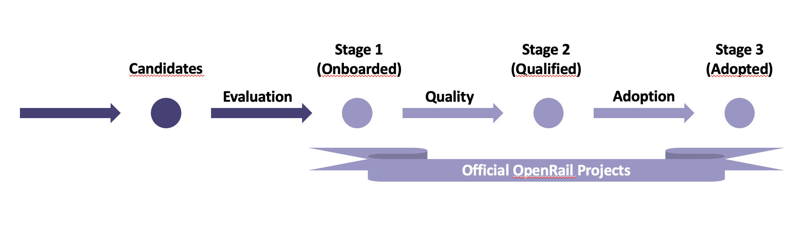

# OpenRail Incubation process

> _**Note:** This is the official specification of the OpenRail incubation process. All substantial changes must be approved by the Technical Committee._

This document describes the incubation process for projects in the OpenRail Association. This includes how a project can join OpenRail as well as how a project can move to subsequent stages of maturity.

Projects can be in four stages which are reflecting the maturity of the project and the level of adoption in the OpenRail community (Onboarded, Qualified, Adopted, Retired). For each stage the project has to fulfill a set of criteria. Projects can propose to be moved from one stage to the next. The TC will evaluate the proposal and decide if the project can move to the next stage.

Previous naming scheme:

The criteria for entering each stage cover the compliance, business, and technical evaluation of the project. The evaluation has to be done for each version of the project. A community version could be accepted and not the enterprise version.

The criteria for each stage are listed in the subsequent sections along with the process of how projects are accepted into the corresponding stage. Projects are going through the stages in a sequential order, stages can't be skipped, even if the project is already starting from a mature point. The exception is the Retired state which can always directly be entered by projects which are not active anymore.

## Stage 0: Candidate

Projects which intend to join the OpenRail Association are considered candidates. Candidates are not yet OpenRail projects. They are evaluated by the Technical Committee on request of the project to become part of the OpenRail Association. Candidates need to at least fulfill the criteria for the Onboarded stage to be accepted into the OpenRail Association.

## Stage 1: Onboarded

The Onboarded stage is the initial stage for projects being hosted by the OpenRail Association. Onboarded projects meet the minimal requirements necessary for being considered to be part of the OpenRail Association.

The Onboarded stage is the entry stage for all projects hosted by the OpenRail Association. This stage is meant for projects to mature and work on meeting the criteria for the Incubation stage while already being part of the OpenRail Association. This can be projects that are in an early phase or it can be projects which already are mature. More mature projects will likely spend less time in the Onboarded stage.

The barrier for entering the Onboarded stage is intended to be low, so that it's easy for projects to become part of the OpenRail Association and the work necessary for moving to the next stage can be done within the Association with the support of the Technical Committee.

### Criteria

* **The project contributes to solving challenges of the railway sector in an open collaborative way so that it is in the scope of the purpose of the OpenRail Association.**
* **The project is clearly described so that the OpenRail Association and potential users and contributors have a clear idea what it does.** The description and additional information is documented as part of the new project questionnaire.
* **The project has designated its maintainers so that it is clear who is making decisions in the project and can add additional contributors.** The maintainers are documented in the project repository.
* **The project adopts the OpenRail Association Code of Conduct so that social norms are well defined and enforced.** The code of conduct is documented in the project repository.
* **The project adheres to the OpenRail Association IP Policy so that there is a safe and equal base to use and contribute to the project.** This means in particular that the repo only contains code licensed under an OSI approved license and that the project intends to transfer any trademarks related to the project to the OpenRail Association.

### Process

1. The project applies to join the Onboarded using the [New Project Questionnaire](project-proposals/stage-1/stage-1-questionnaire.md).
2. The Technical Committee evaluates the application and works with the project to address any open issues.
3. On a positive evaluation the Technical Committee prepares the decision to accept the project as an OpenRail Association project.
4. According to the statutes of the OpenRail Association Article 22 the OpenRail board finally decides about the acceptance of the project based on the decision prepared by the Technical Committee.
5. The project is accepted into the OpenRail Association as Onboarded project and their code is moved to the [GitHub organization of the OpenRail Association](https://github.com/OpenRailAssociation).
6. The project is listed on the [OpenRail Association web site](https://openrailassociation.org).
7. Onboarded projects can use the badge "OpenRail project (Onboarded)" (to be created).

## Stage 2: Qualified

The Qualified stage is for projects that have reached a high level of quality and maturity that indicates they are ready to be used by end users. Qualified projects meet the main criteria of the OpenRail Association which make sure that the project is governed openly. Open governance means that decisions are taken in a transparent way and there is a path to become committer and maintainer based on the merits of contributions.

The Qualified stage focuses on quality criteria the project can reach on its own and doesn't require a high degree of external adoption or contributions yet.

The barrier for entering the Qualified stage is intended to be high, so there is a high level of quality for projects which have reached this stage.

### Criteria

* **The project has a healthy base of contributors so that it is developed in a sustainable way.** It has a healthy number of committers, i.e., people who can accept contributions to some or all of the project. Committers can come from the same organization. It demonstrates a substantial ongoing flow of commits and merged contributions. Since these metrics can vary significantly depending on the type, scope and size of a project, the TC has final judgement over the level of activity that is adequate to meet these criteria.
* **There is a clear release process so that users know what to expect from releases.** This includes transparency about the release cycle, communicating changes via changelogs, and a clear versioning scheme. It also includes cryptographically signing release artifacts so that users can make sure they receive the software from trustable sources. It's recommended to provide SBOMs for all release artifacts.
* **Specifications must have at least one public reference implementation so that the practicality of the specification is demonstrated and adopters have a base to start from.**
* **The project has implemented an open governance process so that participation in the project becomes possible.** It is documented how decisions are taken in the project and how people can become committers and maintainers. Listing and documenting the channels / means of communication used by the project is also essential for an open governance.
* **There is a public business roadmap so that there is transparency about what drives the project.**
* **The project's software is used in production so that it is demonstrated that the software is ready for serious use.** It is sufficient if this is only the organization developing the project.
* **There is clarity about the licensing of the project so that it can be safely used in a compliant way.** To achieve that the project is [REUSE](https://reuse.software) compliant and there is an automatic check which runs the REUSE linter. These detailed requirements and processes are documented [here](project-handbook/reuse.md).
* **The project requires the [Developer Certificate of Origin (DCO)](https://developercertificate.org/) so that there is clarity about the provenance of contributed code.** The presence of the DCO information is automatically checked so that it is made sure that it is present in all commits.
* **The project follows baseline security best practices.** The project pins its dependencies and has an automated process to detect and update (vulnerable) dependencies. The project reaches an [OpenSSF Scorecard](https://openssf.org/projects/scorecard/) score of at least 5/10 and communicates the score with the check date in `README.md`. The project has a security policy in `SECURITY.md`. These best practices are detailed [here](project-handbook/security.md).

### Process

1. Apply to move to Qualified using the questionnaire (to be done).
2. The Technical Committee evaluates the application and works with the project to address any open issues.
3. On a positive evaluation the Technical Committee decides to accept the project as a Qualified project.
4. Qualified projects can use the badge "OpenRail project (Qualified)" (to be created).

## Stage 3: Adopted

The Adopted stage is for projects which have reached a level of high maturity and adoption. They are the flagship projects of the OpenRail Association.

The Adopted stage is for projects which have not only reached a high level of quality, but also demonstrate that they are widely used and have a diverse set of contributors. This indicates that they can be relied on and they don't depend on a single organization.

Projects at the Adopted stage fit into the overall architecture of the OpenRail Association. There are no competing projects on this stage which implement the same capabilities.

### Criteria

### Criteria

* **The project is used in production by at least three independent adopters so that it demonstrates widespread real-world relevance.** Adopters must be of adequate quality and scope. The TC evaluates this based on the context of the specific project. Where needed, commercial support should be available to meet production requirements.
* **There is a public list of adopters so that usage is transparent.** This should be listed for at least the primary repository, ideally in the `publiccode.yml` file. For specifications, adopters of the reference implementations must be documented.
* **The project has committers from at least two independent organizations so that its development is resilient and not dependent on a single entity.** A diverse contributor base strengthens the sustainability and community health of the project. Diversity of contributors is documented through suitable committer statistics. The TC evaluates this based on the context of the specific project.
* **The project regularly produces stable releases so that users can rely on predictable updates.** A clear release cadence and a history of stable releases are documented.
* **Security updates follow a documented and time-bound process so that users can rely on timely responses to vulnerabilities.** This process is described in the project’s `SECURITY.md` file and complements the Stage 2 security requirements.
* **The project has passed an independent third-party security audit so that critical risks are identified and resolved.** All critical vulnerabilities must be addressed before progressing to this stage. The audit should also assess the architecture and development process from a security perspective.
* **The project follows thorough security best practices so that it demonstrates strong security and quality.** It reaches at least 8/10 on the [OpenSSF Best Practices Badge](https://bestpractices.coreinfrastructure.org).
* **SBOMs are provided for all release artifacts so that the project provides transparency of its supply chain security.** Availability of SBOMs in a standard format is documented as part of the release documentation.
* **The project has adequate funding so that ongoing maintenance is ensured.** Current funding sources and prospectives for the future are made transparent. This is documented as part of the questionnaire.

### Process

1. Apply to move to Adopted stage using the questionnaire (to be done).
2. The Technical Committee evaluates the application and works with the project to address any open issues.
3. On a positive evaluation the Technical Committee decides to accept the project as an Adopted project.
4. Adopted projects can use the badge "OpenRail project (Adopted)" (to be created).

## Stage 4: Retired

Projects that aren't developed anymore or that have been replaced by another project are moved to the Retired stage.

### Criteria

* Project has no active maintainers
* Development activity has slowed significantly

### Process

1. A project requests the project to be moved to the Retired stage or the Technical Committee finds that an existing project is not active anymore.
2. The project is noticed that it is about to be moved to the Retired stage.
3. The project can object and provide evidence that it still is active.
4. If there is no evidence that the project is still active the Technical Committee decides to move the project to the Retired stage.
5. The project is clearly marked as Retired in its GitHub repository and any other relevant locations.

## References

The stages and the process are inspired by the [CNCF project lifecycle process](https://github.com/cncf/toc/blob/main/process/README.md) and the [LF Energy technical project lifecycle](https://wiki.lfenergy.org/display/HOME/Technical+Project+Lifecycle).
