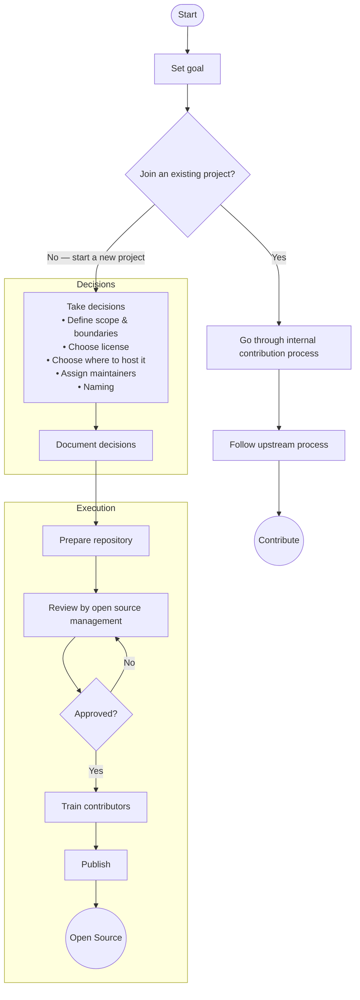

# How to Open Source a Software Project

This guide explains how to open source a software project. It guides you through the decisions which need to be taken and the practical steps to publish code as open source software for the first time.

## Motivation

There are many reasons why it can be a good idea to open source a software project:

* Increasing adoption and setting standards
* Establishing transparency and trust
* Building partnerships and ecosystems
* Reducing costs through shared development
* Attracting talent and engaging employees

There is excellent material available in the community which dives deep on each of these motivations and some more. Good starting points are TODO Group's ["Guide to Outbound Open Source Software"](https://todogroup.org/resources/guides/a-guide-to-outbound-open-source-software/), Bitkom's ["Open Source Guide"](https://www.bitkom.org/sites/main/files/2024-04/bitkom-opensource-guide-en.pdf) and Mozilla's ["Framework For Purposeful Open Source"](https://blog.mozilla.org/wp-content/uploads/2018/05/MZOTS_OS_Archetypes_report_ext_scr.pdf).

When the primary decision is taken to open source a project, there are a number of additional questions to consider. And there are practical decisions and steps to be taken to finally publish the project as open source software. The rest of this guide covers all these subsequent steps.

## Goal

First of all you need to be clear about the goal of open sourcing the project. This will influence all the other decisions you need to take.

Is adoption the main goal or transparency? What kind of community do you expect to build around the project? Who are the partners you want to attract? Which motivations do you want to address by open sourcing the project? These kinds of questions should be answered.

Be explicit and document your goal. Don't overthink it. Goals can evolve over time. Even not having a goal can be ok.

Once you are clear about your goal you will need to take some decisions to define the framework of your project.

## Decisions

This section lists the main decisions you need to take and what deciding factors are involved.

### Join vs. Start

Starting a completely new project might not always be the best path forward. In many cases joining an existing one could give you much more momentum because you can build on an already existing project, its community and visibility.

If you are doing something completely new, starting a fresh project is the only choice.

If you want to go fast without having to coordinate with an existing community, starting a new project might also be the right choice. This will make it harder to find adoption and you set up competition. Depending on your goals, this could be a feature or a bug.

If you already have code and there are technical barriers which make it hard to put it into the context of an existing project, starting a new project is the pragmatic choice. You need to build the momentum yourself, though.

In other cases joining an existing project probably is the better choice. This will mean that many of the other decisions will already be predefined by the conventions and rules of the community you join. So you need to check if they are compatible with your goal.

There is also an area where you can join an existing ecosystem with a new project. We will cover this in the section about where to host the project.

### Scope and Boundaries

When open sourcing a project you open your project to the world. You are still in control, but to get the benefit of collaboration across organizations and the dynamic of a healthy open source community you have to open up and also invite others to responsibly take some control.

You will also have internal company needs and requirements which can't be opened and you will need to integrate open source into internal company processes, for example your development life cycle. Balancing these needs with those of the wider community is one of the key challenges. You will need to set the scope and the boundaries of the open source project in a way that it serves both yourself and the community.

One useful model is to separate the external and the internal needs and think about it in project vs. product. The project is the open source project, where the community is in charge, individuals come together on eye-level and develop the open source base which is useful to the world. The product is what you build on top of it to make it your company's product. There your company is in charge. The product can take many forms; it could for example be packaging of the open source project, or proprietary extensions which are based on the open source project, or it could be running the open source project internally in production. In all these cases you do want to benefit from the development in the community, but you also need to match the constraints you have for your product.

Note that this separation of project vs. product does not mean that the project is out of your control. You will be the sole maintainer at the beginning and will be able to take decisions in this role which align with your internal company needs. But to build a community you need to share this space with others, so that they can also benefit from the project according to their needs. This is why it's important to have a clear vision about the direction of the project; then all participants can direct their engagement and contributions in a way which creates value for everybody.

Even if you are the sole contributor to the project and it's the same people who work on the project and the product it makes sense to think in these terms and separate concerns. This gives a clear structure, increases quality, and sets up the project for success in the community.

If there is a good balance and scope and boundaries between project and product are clear, then you can achieve a win-win situation where project and product power and accelerate each other. But to be frank, it does take courage to embrace openness.

Write down what belongs in the community project vs. what stays in your product; clarity here prevents friction later.

In a healthy setup you will achieve the following traits:

#### Project

* Community-driven, under open governance
* Decisions by maintainers & contributors, based on technical merit
* Influence comes from contributions, not corporate status
* Inclusive, welcomes contributions from diverse stakeholders
* Balances stakeholder interests while staying aligned with project vision

#### Product

* Company-controlled, developed & maintained internally
* Can be a commercial product or used in internal operations
* Influences the project through contributions & active participation
* Built on the open source project, but technically separate

### License

One of the most important decisions is the license under which the project will be published. This is one of the decisions which is harder to change later on. A license change will mess with the expectations of users. And when you have more contributors, all of them will need to agree to a license change. So in the ideal case you decide on the license and stick with it for the lifetime of the project.

Things to consider:

* Use a license which is approved by the [Open Source Initiative (OSI)](https://opensource.org) as [open source](https://opensource.org/licenses). This is the only way to guarantee that the license communicates clear expectations and finds broad acceptance in the community.
* Stick with commonly used licenses. The more exotic the license is, the harder it is to explain to people what it means. A rarely used license creates barriers which can be avoided by using a license which is well known and understood.
* Choose an up-to-date license. There are multiple versions of many licenses. Use the most recent one, so you benefit from the experience which has gone into the evolution of the licenses.
* For a project which is truly open, the license will be enough. You won't need additional agreements such as a Contributor License Agreement. These only create additional barriers with no substantial benefit. Using the [Developer Certificate of Origin (DCO)]() can add some explicitness to the licensing process for contributors. It isn't strictly necessary, either.
* When a license has an option to allow users to upgrade to a newer version of the same license, use this. This will make it easier for you and your users to maintain the license long-term.

The main decision in terms of concrete license will be the type of license and what obligations it imposes.

We generally differentiate the following types: permissive, weak and strong copyleft, and copyleft with network clause. There is a lot of good material available in the community which details how these types of licenses work and what their different mechanics are. Good starting points are Bitkom's ["Open Source Guide"](https://www.bitkom.org/sites/main/files/2024-04/bitkom-opensource-guide-en.pdf) or Wikipedia's article about [open source licenses](https://en.wikipedia.org/wiki/Open-source_license).

Use a **permissive** license when you want to go for **maximum adoption**. These licenses impose very few restrictions and can safely be used in all environments, including commercial and proprietary products. Most popular choices are Apache-2.0, MIT or the family of BSD licenses. **Apache-2.0** is a good default choice because it's a relatively modern license which is actively maintained by its steward, the Apache Software Foundation. It also is quite explicit, so that there is less ambiguity than with some of the older and simpler permissive licenses.

The caveat with a permissive license is that others can integrate your software in their products, even proprietary products, and have no obligation to open anything else or give back. So if your business model relies on exclusiveness of your software on the market, another license type might be the better choice.

A **weak copyleft** license has a similar effect from a business model point of view as a permissive license. The difference is that changes to the project itself must be provided under the same license. This way you can guarantee that **improvements to your project** are made available to the community again, but you can't prevent proprietary products based on your software. A weak copyleft license can be a bit of a hurdle, especially in practical terms. Most common weak copyleft licenses are **EPL-2.0**, **MPL-2.0**, and **LGPL-3.0-or-later**.

Use a **strong copyleft** license when you want to **ensure freedom** of the project. The strong copyleft makes sure that all software based on your project also has to be released under the same open license. This means that others cannot build proprietary products with it. So it will always be part of the FOSS ecosystem. It also means that many proprietary vendors will not touch the software, so it limits adoption. The most popular strong copyleft license for a new project is **GPL-3.0-or-later**.

Use a **network copyleft** license when you want to **ensure freedom of a service**. Traditional copyleft licenses don't consider the use case of running software as a service. They don't give any freedoms or rights to the users of the service. Network copyleft licenses close this loophole and give users the right to get the source code of the service, so they can run it themselves. Choose this license if you want to prevent others from running a closed service based on your software. It will limit adoption, though. Some companies might not touch network copyleft code out of principle. The most popular choice for a network copyleft license is **AGPL-3.0-or-later**.

Also consider the ecosystem you want to publish the project to. There might be licensing conventions in the community, which make sense to follow to minimize friction. For example, when you consider the option to give a project to the Eclipse Foundation, choose the Eclipse Public License (EPL-2.0), or when you publish into the Node ecosystem use the MIT license, which is the standard choice there.

### Maintainers

Maintainers play a critical role in an open source project. Those are the people who are in charge, who ultimately take the decision about what code is included and who can join the project. They also take responsibility so that the project can react when security issues are found, conflicts arise in the community, or to represent the project to the outside. It's a demanding but also satisfying role.

To establish trust in a project and to make it clear to its community, including its users, who is in charge, it's important to be transparent about who the maintainers of the project are. It also should be transparent how people can become maintainers, and it should be made sure that in case a maintainer leaves the project, successors are established.

There are different shapes and forms of maintainers, often having emerged from the history of the project. Ideally you have a group of maintainers, so that load can be shared and people can take time off without the project being put in jeopardy.

How this is organized depends on who is involved and what the goals of the project are. But to get the maximum benefit of open source, it should follow the principles of an [open governance](https://opengovernance.dev) model.

So when open sourcing a project, make sure you have a group of maintainers who have enough time to take care of the maintainers' responsibilities.

### Where to host it?

An open source project needs a place to live. This usually means a combination of tools in the virtual world which provide space to host code, to discuss the project and for people to interact. It also means having some organizational form which allows you to host assets such as possible trademarks, domain names, or money to spend on community activities such as conferences.

Here are the main options you have and when they fit:

#### Just a repository

For small, individual, or experimental projects it might be enough to just create a repository on one of the code hosting platforms such as GitHub. They mostly offer free plans for open source projects. This also gives you access to tools such as issue trackers and basic discussion features.

It does not provide you with any governance or organizational support. That means you have to cover that as an individual or, if it's a company project, with the usual means of your organization. This can be a challenge in an environment where open source is not well understood.

It could also be a limiting factor for adoption or contributions because only having one individual or organization behind the project could be seen as a risk for the long-term health of the project. Also, some organizations will be hesitant to contribute to a project which is owned by another organization and will prefer neutral ground.

The OpenRail Association provides a special space for such repositories without much support or restrictions in the [OpenRail-Playground organization](https://github.com/OpenRail-Playground) on GitHub.

#### Join a foundation

There are many open source organizations which provide an organizational home for open source projects. These are usually called foundations because they are organizations meant to act as a neutral base for a diverse set of participants. The actual legal form will vary, but it's often non-profit types such as the Belgian AISBL or the American 501(c).

Some of the organizations such as the [Linux Foundation](https://www.linuxfoundation.org/), the [Eclipse Foundation](https://www.eclipse.org/), or the [Apache Software Foundation](https://apache.org) have a pretty general scope and cover lots of different topics. Other foundations are aimed at specific industries, such as [LF Energy](https://lfenergy.org), [Open Logistics Foundation](https://openlogisticsfoundation.org/), or the [OpenRail Association](https://openrailassociation.org).

A foundation will have infrastructure to facilitate hosting a project and organizational support for administrative tasks. It will also provide guardrails for the governance of the project which make sure that the project adheres to proven good practices in the open source community and that there is an open space for collaboration of partners, even if they are diverse and might even be competitors outside of the project. This includes taking care of antitrust questions.

This is the preferred option because it provides the most stable and broad base for an open source project. It provides the neutral ground where people and organizations can meet and collaborate on eye-level.

The OpenRail Association has a defined [incubation process]() for how projects can join the organization. Follow that to get your project on board and join the set of [official OpenRail projects]().

#### Join an umbrella organization

There are some organizations which act as umbrella organizations for other open source projects. That means they can represent a project in financial and other organizational matters but act more or less as a proxy and don't get involved with running the project. Examples are the [Software Freedom Conservancy](https://sfconservancy.org/) or [SPI](https://www.spi-inc.org/).

These organizations can work well for individual projects which need an organization from a practical point of view but are operating mostly individually in most ways.

#### Create a new organization

Creating a new organization is usually not a good option because it takes a lot of effort and comes with quite some obligations. There also are many existing organizations to cover most needs, and joining an existing organization always has the advantage that you can benefit from the reach and experience which is already there.

In some special cases it still might be preferable to create a new organization. But you need to know what you are doing if you go down this path.

### Naming

Naming is hard, but choosing a name for your open source project is a small step with large consequences. A good name reduces friction, avoids legal risk, and supports adoption. Renaming a project later is painful for users and contributors, so it is worth taking a moment to get this right early.

Things to consider:

* Clarity and recognizability - Pick a name that is easy to pronounce, search for, and understand. Avoid overly generic names which make it hard to find the project online.
* Avoid conflicts - Check that the name is not already widely used in open source ecosystems, commercial products, or trademarks. Search GitHub, PyPI/npm, Debian packages, and trademark databases if possible.
* Domain names - You usually don’t need a dedicated domain, but if you want one, check availability now, not later.
* Neutrality - Avoid names tied to specific companies or products. Neutral names make collaboration and adoption easier.
* Cultural and linguistic check - Make sure the name works in common languages in your ecosystem and does not unintentionally refer to something inappropriate.
* Optional: trademark - A trademark is not required, but if you want one, choose a name where you could register it later if necessary.

## Procedure

With the main decisions in place you can go through the practical steps of preparing and publishing your project as open source. This section describes an exemplary workflow. Depending on your organization and how you manage open source there, your workflow might look different. Adapt it as you see fit.

Here is the description of the individual steps in the process:

### Set goal

As described in the section [Goal](#goal) at the beginning of this document, be clear about the goals of the project. This will give you the base for following decisions. It can also give you a way to measure success.

### Join an existing project?

Decide whether to join an existing project or start a new one based on the criteria defined in section [Join vs. Start](#join-vs-start).

### Go through internal contribution process

Every company has (or should have) some kind of internal contribution process which enables employees to contribute on behalf of the company. This includes reviewing the project where the contribution is going to, making sure no internal restrictions or requirements are violated, and that contributors are properly trained. More information can for example be found in TODO Group's ["Guide to Outbound Open Source Software"](https://todogroup.org/resources/guides/a-guide-to-outbound-open-source-software/).

### Follow upstream process

Every open source project has some policies and conventions they expect to be followed. The main entry point usually is the CONTRIBUTING.md file in the root of the project's repository. Take the time to make yourself familiar with what is expected and make sure that you follow the project's conventions. More information can for example be found in TODO Group's guide for [Employee Open Source Engagement](https://todogroup.org/resources/guides/employee-open-source-engagement/).

### Take decisions

If you are starting a new project you need to take a number of decisions as described in the section [Decisions](#decisions).

### Document decisions

Make sure the decisions are documented so that it's transparent for current and future participants why the project is set up in the way it is. This can be internal documentation, be part of the open source project, or a combination of both, depending on the nature of the decision.

One good practice is to use the format of an [Architecture Decision Record (ADR)](https://adr.github.io/) to document the decisions.

### Prepare repository

Open source repositories follow certain [common conventions](https://docs.github.com/en/communities/setting-up-your-project-for-healthy-contributions), such as having a README.md, a CONTRIBUTING.md and other files. And depending on where you host the project, there will also be conventions for how to document the governance of the project and other aspects. Set up the repo following all these conventions.

### Review by open source management

As part of the contribution process of your company there most probably will be some kind of review or approval required before a new repository can be published. It is a good practice to set up an internal repository which contains exactly the state you want to publish, including the repository history. Then a review by the people responsible for open source management can check that rules are met, no internal information is included, and other criteria which will be applied.

This usually is an iterative process, where a first review will result in some issues which need to be fixed in order to make the repository ready to actually be open sourced.

### Train contributors

To work in the open requires people to take responsibility for what they do, have awareness of the context and consequences of their activities, and be skilled in executing the work in an open source project. As an organization you need to make sure that contributors are trained so they know about rules and expectations, and develop the skills required.

The [guides of the TODO Group](https://todogroup.org/resources/guides/) are a good resource for people who set up such training.

### Publish

The final step of the open sourcing process is publishing the repository you have prepared. Congratulations! This is the beginning of the journey of your open source project.

## References

* [Guide to Outbound Open Source Software](https://todogroup.org/resources/guides/a-guide-to-outbound-open-source-software/) - Covers setting up processes for employees to contribute to external projects and starting new open source projects
* [Open Source Guide](https://www.bitkom.org/sites/main/files/2024-04/bitkom-opensource-guide-en.pdf) - Explains license mechanics, types (permissive, weak/strong copyleft, network copyleft), and practical considerations
* [Framework For Purposeful Open Source](https://blog.mozilla.org/wp-content/uploads/2018/05/MZOTS_OS_Archetypes_report_ext_scr.pdf) - Mozilla's research on different archetypes and motivations for open source projects
* [Open Source Initiative (OSI)](https://opensource.org) - The authority that approves and maintains the definition of open source licenses
* [Open source licenses](https://opensource.org/licenses) - Complete catalog of OSI-approved licenses
* [Open-source license](https://en.wikipedia.org/wiki/Open-source_license) - Overview of license categories and their legal implications
* [Open governance](https://opengovernance.dev) - Principles and practices for community-driven project governance ensuring equal participation
* [Guide to open source project governance models](https://www.redhat.com/en/resources/guide-to-open-source-project-governance-models-overview) - Red Hat's overview of different governance models commonly used in open source projects
* [OpenRail Association organization](https://github.com/OpenRailAssociation) - Official organization of the OpenRail Association on GitHub
* [OpenRail-Playground organization](https://github.com/OpenRail-Playground) - Low-barrier entry point for hosting repositories without extensive organizational requirements
* [Common conventions](https://docs.github.com/en/communities/setting-up-your-project-for-healthy-contributions) - Standard repository files (README, CONTRIBUTING, etc.) expected in healthy open source projects
* [Employee Open Source Engagement](https://todogroup.org/resources/guides/employee-open-source-engagement/) - How to follow upstream project conventions and contribution policies when participating
* [Architecture Decision Record (ADR)](https://adr.github.io/) - Lightweight format for documenting the context and rationale behind project decisions
* [Guides of the TODO Group](https://todogroup.org/resources/guides/) - Comprehensive library of resources for setting up contributor training and open source programs
