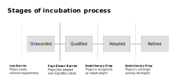

# Incubation process

*This is a draft*

## Funnel

The project is candidate. The Association proceeds to compliance, business and technical evaluation.

### Compliance evaluation:

-	The project provides all the documents (IP, CoC, License, …)
-	The TC check that the project is compliant with the ORF rules.

### Business evaluation

-	The project describes the need it fulfills, and which strategic themes are concerned by the project.
-	The project explains the business roadmap.

### Technical evaluation

-	The project describes the release plan.
-	The project describes the version(s):
  - Is there a community version working on open data?
  - Is there an enterprise version?
  - …
-	The project describes all the stack.
-	The project describes the architecture of the software.
-	The project describes its governance

## Stages

Projects can be in four stages which are reflecting the maturity of the project and the rate of adoption in the OpenRail community (Sandbox, Incubation, Graduated, Retired). For each stage the project has to fulfill a set of criteria. Projects can propose to be moved from one stage to another. The TC will evaluate the proposal and decide if the project can move to the next stage.

*The stages and the process are inspired by the [CNCF project lifecycle process](https://github.com/cncf/toc/blob/main/process/README.md)*

## Sandbox

The Sandbox stage is the initial stage for projects being hosted by the OpenRail Association. Sandbox projects meet the minimal requirements necessary for being considered to be part of the OpenRail Association. The Sandbox stage is meant for projects that are in an early phase and are being prepared for meeting the full criteria of the Incubation stage.

### Criteria

* Apply to join the Sandbox using the [New Project Questionnaire](new_project_questionnaire.md)
* Adopt the OpenRail Association Code of Conduct
* Adhere to OpenRail Association IP Policy

## Incubation

The Incubation stage is for projects that have reached a level of maturity that indicates they are ready to be used by end users. Incubation projects meet the main criteria of the OpenRail Association which make sure that the project is governed openly.

### Criteria

*Examples from CNCF incubation process, to be adopted*

* Document that it is being used successfully in production by at least three independent adopters which, in the TOC’s judgement, are of adequate quality and scope.
* Have a healthy number of committers. A committer is defined as someone with the commit bit; i.e., someone who can accept contributions to some or all of the project.
* Demonstrate a substantial ongoing flow of commits and merged contributions.
* Since these metrics can vary significantly depending on the type, scope and size of a project, the TOC has final judgement over the level of activity that is adequate to meet these criteria
* A clear versioning scheme.
* Specifications must have at least one public reference implementation.

## Graduated

The Graduated stage is for projects which have reached a level of hight maturity and adoption. They are the flagship projects of the OpenRail Association.

### Criteria

*Examples from CNCF incubation process, to be adopted*

* Have committers from at least two organizations.
* Have achieved and maintained a OpenSSF Best Practices Badge.
* Have completed an independent and third party security audit with results published of similar scope and quality as this example which includes all critical vulnerabilities and all critical vulnerabilities need to be addressed before graduation.
* Explicitly define a project governance and committer process. The committer process should cover the full committer lifecycle including onboarding and offboarding or emeritus criteria. This preferably is laid out in a GOVERNANCE.md file and references an OWNERS.md file showing the current and emeritus committers.
* Explicitly define the criteria, process and offboarding or emeritus conditions for project maintainers; or those who may interact with the CNCF on behalf of the project. The list of maintainers should be preferably be stored in a MAINTAINERS.md file and audited at a minimum of an annual cadence.
* Have a public list of project adopters for at least the primary repo (e.g., ADOPTERS.md or logos on the project website). For a specification, have a list of adopters for the implementation(s) of the spec.
* Please include a short one-page narrative based off the Graduation template, no more than 500 words.

## Retired

Project that aren't developed anymore or that have been replaced by another project are moved to the Retired stage.

### Criteria

* Project has no active maintainers
* Development activity has slowed significantly

## TC evaluation and advice to the Board of Directors

The evaluation has to be done for each version of the project.
A community version could be accepted and not the enterprise version.

## The Board of Director validates the candidate as a project hosted by the OpenRail Association

According to the statutes of the OpenRail Association Article 22 the OpenRail board finally decides about the acceptance of the project based on the decision prepared by the Technical Committee.

## Appendix

### Template for project proposal for Sandbox stage

See [New Project Questionnaire](new_project_questionnaire.md)

### Template for project proposal for Incubation stage

* Project description
  * Compliance
  * Technical
  * Business
* List of criteria and how the project fulfill them
