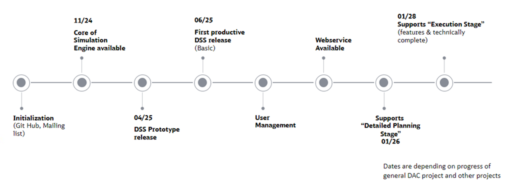

# Questionnaire for DAC Migration DSS

##  What is the project's name?
DAC Migration DSS
(Digital Automatic Coupler Migration Decision Support System)

## Describe the project. What does the project do, why is it valuable, where does it come from?
Within the next years around 500 K freight wagons all over Europe owned and operated by various corporations will be converted from screw couplers to digital automatic couplers (DAC). To facilitate the migration process, a decision support system (DSS) is planned under the project.

## Who are the maintainers of the project (these will be the primary contacts for the OpenRail Association)?
Initially DB Cargo (Frederik Schäfer) / DB AG  (Hanno Schülldorf, hanno.schuelldorf@deutschebahn.com), during the work process it is likely that others will join.

## Which organizations are sponsoring/contributing to the project?
Deutsche Bahn AG and DB Cargo. However, we expect that other organisations that are involved in EU-Tenders, will participate in near future. Once the project is mature various stakeholders within the industry are likely to join.

## Where is the code hosted?
It is a new project and we would like to host it in the Open Rail Association Repository from start on.

## Which exact repositories do you intend to transfer to the GitHub organization of the OpenRail Association?
see above

## What is the project's main license?
not decided - GNU (some variant) or Apache 2.0

## What other licenses does the project use, e.g., for included 3rd party code?
None up to now. However, public APIs of proprietary software (e.g., commercial solvers such as gurobi) will probably be used.

## Are any trademarks associated with the project?
Currently, no trademarks are associated.

## Does the project have a web site? Where is it? Are you ok with moving it to be hosted by the OpenRail Association?
Currently no website

## What are the communication channels the project uses (such as mailing lists, Slack, IRC, etc.)?
Mailing Lists, GitHub functionality

## What is the project's leadership team and decision-making process?
Currently: Maintainers, Andreas Lipka, Helge Stuhr, Christian Friedrich.
Applications to join the team are welcome. Currently we are eager to strengthen the computer science competence of our leadership team. Nevertheless, candidates with all professional backgrounds are appreciated.
Due to the yet compact size, there is no formal decision-making process. Everybody is invited to contact the maintainers and make suggestions which will be discussed individually by the leadership team.

## How is development of the project planned and organized? Is this transparent to the public?
Agile project management is applied. Basically, the project is planned along the roadmap below which will be updated according to development of the overall DAC project and other adjacent projects. Though everybody can report issues and make pull request we encourage people who are willing to contribute to contact the maintainers in advance. This way it can be made sure that the project can proceed efficiently, and contributors’ time spent is generating as much value for the community as possible.

## What is the project's roadmap?

## What other organizations in the world should be interested in this project?
The European Union, especially Europe’s Rails and EDDP organisation, other organisations like UIC, all FOC companies within Europe (very high), wagon keepers across Europe (very high), infrastructure managers (some), coupler producers (some), operators of industrial railways (high),
EDDP (European DAC Delivery Programme) Management Board has shown some primary interest to use open source software for migration planning.

## Why would this project be a good candidate for inclusion in the OpenRail Association?
For several reasons: Firstly, because just like the OpenRail Association, the DAC Migration DSS has a pan-European focus, and secondly, because members of the association are likely to be benefiting from the work. Furthermore, we believe that the high standards of the OpenRail Association will promote the visibility of the project and encourage potential contributors to participate.

## Are there competing products or projects? If there are, please explain how the proposed projects differentiates.
No, as far as we know not.  However, there are several complementary projects which deal with handling data of wagons and locomotives.

## What standards does the project implement or rely on? How are they related to other existing standards?
Agile Management will be applied for project organisation. Coding standards have not been fixed yet, however this will be discussed soon. E.g., tools like SonarQube might be applied. As a general goal we want to stick to well accepted standards as much as possible to keep barriers to contribute low while ensuring a high quality.

## What is the tech stack of the project? Name the major programming languages and frameworks which are used.
Not decided yet. Within the project it is discussed if it should focus more on popular interpreter languages like Python or performant compiler languages like e.g. C++, ….)

## What is the project's plan for growing in maturity if accepted within the OpenRail Association?
Open for now

## Concluding statements

By sending this questionnaire you confirm that the project will adhere to the [code of conduct](CODE_OF_CONDUCT.md) of the OpenRail Association.

By sending this questionnaire you confirm that the project intends to be incubated in the OpenRail Association and plans to meet the maturity criteria set out by the OpenRail Association for incubated projects.
